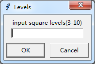
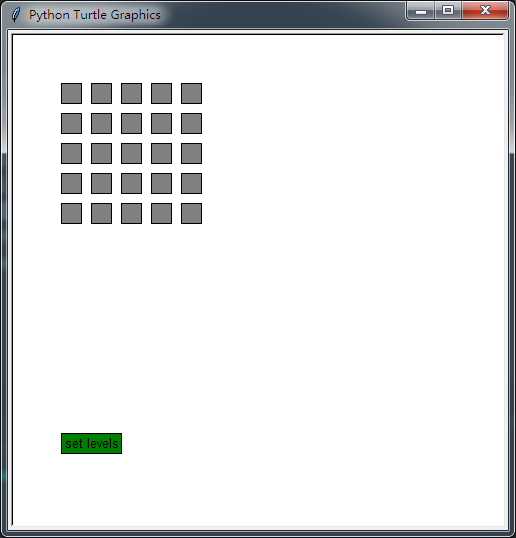
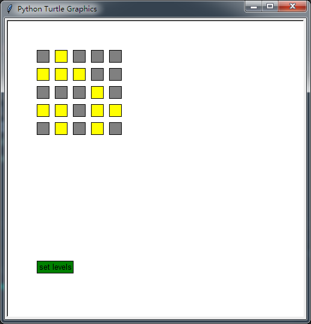

# game_of_lamps

这是一个亮灯/熄灯小游戏，打开/关闭一盏灯，其相邻的灯的状态都会反转。目标是将所有灯都点亮或熄灭。

This is a game of lamps, if you turn on / turn off a lamp, state of lamps adjacent to it will be reversed. your target is turn on / turn off all the lamps.

首先输入灯矩阵的级数。

Firstly you input how many levels of lamps you will play. 

点击一盏灯可改变其状态，开始游戏吧。

Press a lamp and change its state, and start the game!

"set level" 可以重设灯的级数，并重置游戏。
"set level" can reset levels of lamps, and reset the game.

## 注意   Notice
需要安装"turtle"库。

"turtle" is needed.